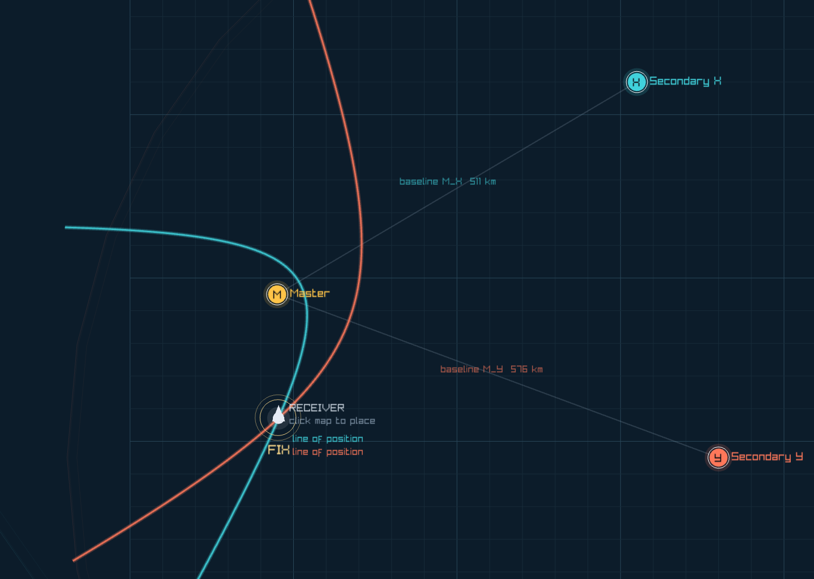

# LORAN Chain Visualization

An interactive demo of how **LORAN** (LOng RAnge Navigation) turns radio timing into a position fix.



Press **Space** to watch a Master and two Secondary stations fire in sequence. The receiver measures time differences; each difference becomes a hyperbola; where those hyperbolas cross is your **fix**.

## What is LORAN?

Before GPS, ships and aircraft often found themselves with **LORAN** — a ground-based radio navigation system. A *chain* of synchronized transmitters broadcasts carefully timed pulse groups. Your receiver does not need to know absolute time. It only needs the **time difference (TD)** between hearing the Master and hearing each Secondary.

That is enough to locate yourself.

## The idea in one picture

| Piece                | Role                                                                                                                |
| -------------------- | ------------------------------------------------------------------------------------------------------------------- |
| **Master (M)**       | Reference transmitter. Everything is timed from its pulse.                                                          |
| **Secondary X / Y**  | Partner stations on known baselines from the Master.                                                                |
| **Emission delay**   | How long after the Master each Secondary waits before transmitting (baseline travel time + a fixed *coding delay*). |
| **TD**               | Time from Master arrival to Secondary arrival at *your* receiver.                                                   |
| **Line of position** | All points with the same TD for one Master–Secondary pair — a **hyperbola**.                                        |
| **Fix**              | Intersection of two lines of position (you need at least two Secondaries).                                          |

Why a hyperbola? Radio travels at a constant speed. A constant difference in travel time is a constant difference in distance to two foci (Master and Secondary). The set of points with a fixed distance difference is a hyperbola.

```text
  path difference  ≈  c × (TD − emission delay)

  | distance(you, Secondary) − distance(you, Master) |  =  constant
            └── that constant draws one hyperbola ──┘
```

Two pairs (M–X and M–Y) give two constants, two curves, and one crossing: the fix.

## What this demo shows

Light is slowed down on purpose so the sequence is visible in seconds instead of microseconds.

1. **Master transmits** — an expanding wavefront leaves M.
2. **Secondary X transmits** after its emission delay.
3. **Secondary Y transmits** later on its own schedule.
4. The **receiver** marks when each pulse arrives and reads TD(X) and TD(Y) on the timeline.
5. Known emission delays are subtracted to recover path differences.
6. The two **hyperbolas** appear; their intersection is labeled **FIX**.

Click anywhere on the map to place the receiver, then replay to see how TDs and lines of position change.

## Run it

Requires [.NET 10](https://dotnet.microsoft.com/download) (or a compatible SDK).

```bash
dotnet run
```

### Controls

| Key / action          | Effect                                             |
| --------------------- | -------------------------------------------------- |
| **Space**             | Play / pause (starts the chain from Ready or Done) |
| **R**                 | Replay from the current receiver position          |
| **[** / **]**         | Slow down / speed up                               |
| **1** / **2** / **3** | Speed presets                                      |
| **Click map**         | Place the receiver                                 |
| **Scroll**            | Zoom                                               |
| **WASD** / arrows     | Pan                                                |

## Going further

- Real LORAN-C used ~100 kHz groundwave pulses, group repetition intervals, and much longer baselines (hundreds of kilometres).
- Receivers tracked pulse envelopes and cycles for finer timing than a single edge.
- Modern GNSS replaced operational LORAN in many regions, but the geometry — TDOA and hyperbolas — still shows up in multilateration, secondary surveillance radar, and some backup PNT concepts (e.g. eLoran).

This project is a teaching toy: scaled speed of light, simplified pulse model, and a single receiver. The geometry of the fix is the real thing.
